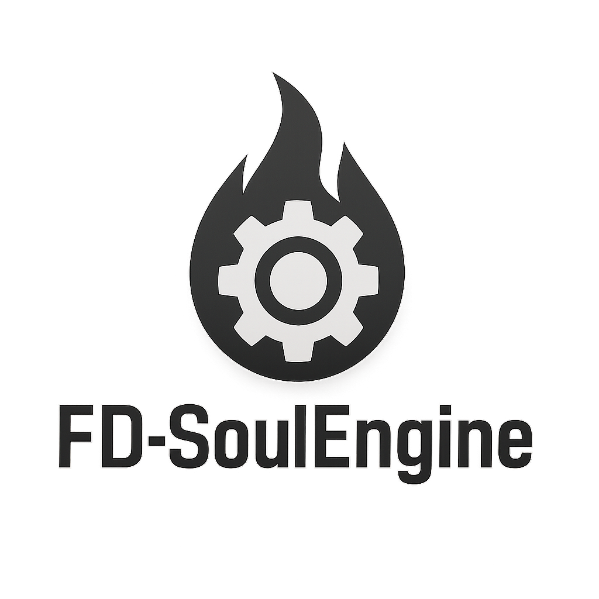

<p align="center">
  
</p>


---

  

---

## Технические детали
- **Язык:** C++17, GLSL  
- **Метод отрисовки:** OpenGL 3.3 (GLFW + GLAD)  
- **Платформы:** Linux (поддержка Windows планируется)  
- **Сборка:** Make / CMake (поддержка build.sh)  
- **Аудио:** miniaudio
- **Форматы текстур:** PNG, JPEG (через stb_image)

---

## Возможности
- Рендеринг 2D-спрайтов с анимацией  (в будущем планируется поддержка 3D)
- Поддержка шейдеров  
- Простая система логирования  
- Гибкая структура проекта  
- Минимальные зависимости  

---
## В планах
- Поддержка Windows  
- Система UI (текст, кнопки, панели)  
- Поддержка Tiled карт  
- Скриптовая интеграция на Lua  

---

## Начальный код для проекта

```cpp
#include "../Engine/include/FDSE.h"

struct MyGame : public fdse::Engine{

    void _start() override{
    }
    void _input() override{
    }
    void _event() override{
    }
    void _loop() override{
    }
    void _draw() override{
    }
    void _stop() override{
    }

};

int main(void){

    MyGame game;
    game.start("Game", 800, 600);

    return 0;
    
}⏎  
```

---

## Структура проекта
``` text
/FD-SoulEngine
	/src - исходный код
	/lib - сторонние библиотеки
	/include - заголовочные файлы
```

---

## Полезные ссылки

- miniaudio (https://miniaud.io/)
- stb (https://github.com/nothings/stb.git)
- glad (https://glad.dav1d.de/)
- opengl (https://www.opengl.org/)
- glfw (https://www.glfw.org/)

---

## Обратная связь
Если у вас есть идеи, советы или вопросы по FD-SoulEngine, вы можете:  
- Оставить комментарий или открыть Issue/Discussion на GitHub.  
- Написать мне в Telegram: [@Fepsid](https://t.me/Fepsid)

---

## License
FD-SoulEngine is licensed under the Apache License 2.0.  
See the [LICENSE](./LICENSE) file for details.

---
